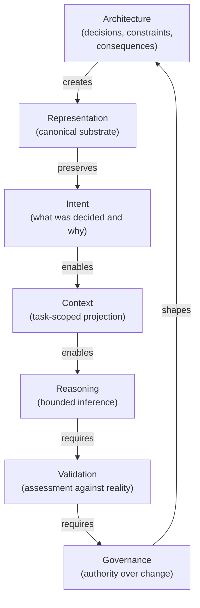

> **Research publication.** This file publishes the MVC representation ceiling thesis as a candidate research theory. It does not define normative STE contracts, production MVC behavior, or Kernel admission.

# Why Architecture, Context, and Understanding Keep Leading Me to the Same Place

For the last several months, I believed I was exploring three different questions.

The first was professional. I have spent most of my career building and governing software systems, and at some point I realized I had never examined what architecture actually is: not the frameworks, not diagram notation, but the thing itself. What is the irreducible content of the claim that a system "has architecture"? Five different traditions define it differently. I went looking for what they agree on.

The second question came from frustration. Every senior engineer I know has had the experience of inheriting a system whose reasoning has vanished. The code runs. The tests pass. The deployment pipeline works. And nobody can tell you why the system is the way it is. Not what it does, but why. What alternatives were rejected. Which constraints were binding at the time. Whether the current shape is deliberate or inherited. I wanted to understand the mechanism, not just name the symptom, but explain why this happens even in disciplined organizations that invest heavily in documentation and knowledge management.

The third was a reaction to something I kept encountering in the AI discourse. "Context" had been reduced to a spatial metaphor: how many tokens fit in the window. But context, the kind that actually makes reasoning possible, is clearly something more than capacity. I wanted to examine what that something more is, across the disciplines that have studied it seriously.

Three different questions. Three different bodies of literature. Three different frustrations. I expected three different answers.

Instead, each question kept leading me to the same place. I did not plan this convergence. I found it, and then I spent considerable time trying to determine whether it was meaningful or whether I had simply constructed three explorations that inevitably agreed with each other.

Whether the convergence reflects something real about how reasoning, representation, and structure relate, or whether it is an artifact of one person asking all three questions, is what this paper examines. What follows is the path I took. The conclusion is not settled. The pattern, I think, is worth taking seriously.

## Architecture: The Thing Being Preserved

Ask five different traditions what architecture means and you will get five different starting points. That is not a failure of the field. It may be the most interesting thing about the question. The summaries below draw on five widely cited traditions.[5]

Software architecture, in the formulation that has shaped a generation of practitioners, is the set of structures needed to reason about the system: software elements, the relations among them, and the properties of those elements and relations (Bass, Clements, and Kazman). The emphasis lands on reasoning. Architecture exists not for its own sake but because someone needs to understand how a system behaves, how it changes, and where it breaks.

ISO/IEC/IEEE 42010 approaches from a different angle entirely. Architecture is "fundamental concepts or properties of a system in its environment, embodied in its elements, relationships, and in the principles of its design and evolution." The emphasis shifts: principles and evolution are first-class. Architecture is not a snapshot. It includes the governing rules that determine how the shape is allowed to change over time.

Systems engineering (INCOSE) describes architecture as the arrangement of elements and the allocation of functions among them. Enterprise traditions such as TOGAF emphasize components, relationships, and the principles that govern design and evolution; Zachman's framework takes a different tack, classifying architecture descriptions rather than offering a single competing definition. Practicing architects stress much the same ground from experience rather than standards documents. Booch's recurring formulation centers on the significant design decisions that shape a system. Fowler, with deliberate understatement, called it "the important stuff. Whatever that is." Kruchten formalized multi-view reconciliation in the 4+1 model: concurrent perspectives on one system, reconciled against actual use cases.

Five traditions. Five different starting points. And yet, reading across them, a recurring set of properties emerges. I count five, though a different reader might draw the boundaries differently.

Each tradition, in its own vocabulary, addresses **elements and their relationships**: you cannot describe architecture without naming the parts and how they connect. Each includes **decisions or principles** that shaped the arrangement; architecture is not accidental pattern but reasoned commitment. Each asserts **reasoning utility**: architecture exists so that someone can think clearly about change, risk, and cost. Each includes some form of **evolution governance**: an ungoverned architecture is an architecture in name only. And each accommodates **multiple stakeholder perspectives**: the same architecture produces different views for different consumers because no single view serves every question.

The disagreement across these traditions is real. They differ on scope boundaries, on whether architecture is the thing or the description of the thing, on how much emphasis to give decisions versus properties. But to my reading, the overlap is more significant than the disagreement. Strip away the jurisdictional differences, and what remains is this: architecture is not the system itself, nor a single diagram of the system. It is governed structure that enables reasoning about the system's shape, its constraints, and its capacity for change. What an organization must do for that reasoning to survive handoffs and time is a further claim — developed below, once decisions, constraints, and consequences are separated.

### Decisions, constraints, and consequences

The claim that architecture is fundamentally about decisions captures something essential. Decisions are the irreducible unit of architectural work. Which database backs the service. Why traffic routes through an inspection layer. The choice to split a monolith at a particular boundary. The selection of retry semantics for a partner API. Each of these constrains every piece of downstream work that follows.

But "the structure of decisions" is necessary and incomplete. It privileges intentionality over actuality. A system has architectural properties that were never decided by anyone.

Architecture also includes **constraints**: the forces that bound decisions whether or not anyone chose them. The compliance boundary that prevents data from leaving a region. The latency budget that rules out synchronous calls to a third party. The organizational boundary that means two teams cannot share a deployment pipeline. Constraints are architectural because they bind future work regardless of whether anyone remembers writing them down.

And architecture includes **consequences**: the structural residue that decisions produce, often beyond what anyone intended. The coupling between two services that resulted from a shared database choice. The single point of failure that emerged from a cost-optimization decision. The blast radius of a dependency that nobody chose on purpose but that exists because three teams independently selected the same library. Consequences are architectural because they shape system behavior whether or not they were designed.

Architecture, then, is not only the deliberate choices but also the forces that bounded those choices and the structural residue those choices produced. A system has architecture even where no one recorded a decision, because constraints and consequences exist whether or not they were named.

Pulling those three together:

> **Architecture is the governed structure of decisions, constraints, and their consequences** — the thing that gives a system a coherent, inspectable shape.

### Multiple views of one structure

Kruchten's 4+1 model formalized what practicing architects already understood: no single diagram captures a system's architecture. A deployment view answers different questions than a logical view. A security view foregrounds trust boundaries that a performance view treats as background. Each view is a projection of the same underlying structure, scoped to the concerns of a particular stakeholder.

ISO 42010 codified this in architecture-description terms: a viewpoint defines the conventions for framing concerns; a view is the work product that expresses the architecture from that framing. The underlying architecture does not multiply when stakeholders multiply; only the projections do. Where views overlap, an architecture description is expected to manage consistency.

### Existence, description, and substrate

ISO 42010 separates the architecture of a system from the architecture description that expresses it. The standard allows architecture to exist as a conception, even one nobody wrote down, and treats architecture descriptions as the work products teams produce when they need to share, review, and reconcile views.

That answers what architecture *is*. It does not answer what an organization needs when the original authors have moved on and the reasoning has to survive handoffs, audits, and refactors.

Once you accept multiple views, a further requirement shows up: not in ISO's vocabulary, but in every organization I have watched try to govern one. Views only work if they are projections of something stable. Where views overlap, they cannot contradict each other without destroying trust. And someone has to maintain the correspondence between what was decided, what was constrained, what resulted, and what each stakeholder sees.

ISO addresses part of this through architecture descriptions: viewpoints frame concerns; views are work products; correspondences and consistency rules manage overlap. That is description discipline. It does not, by itself, solve the problem I keep running into in practice: architecture that lives only in code, only in conversation, or only in someone's head may still *exist*, but the organization cannot inspect it, govern it, decompose work against it, or assemble faithful context for a declared task.

ISO stops at description discipline. Practice demands more: an operational requirement that follows from the multi-view insight and the decay patterns described later in this paper.

For reasoning to compound rather than reset at every handoff, architectural reality within a declared scope must **exist as canonical substrate**: a machine-addressable, graph-shaped model of decisions, constraints, consequences, and the relationships among them. Not a pile of slides. Not a wiki that drifts. Not prose that compresses structure every time it is summarized. A durable structural object that tools and people can traverse, validate against, and slice without forking truth.

I mean **exist** in a strict sense. Tacit knowledge, tribal memory, and code-only embodiment may carry architectural truth, but they are not yet substrate. They are pre-admission material. Substrate begins when commitments are published in forms that compile into that canonical graph, when intent becomes inspectable structure rather than recall.

Externalization is two moves, not one.

The first move is **publication into substrate**: governed intent captured in structured artifacts and merged into a single canonical model. This is the layer optimized for machine traversal, cross-domain linkage, validation, and decomposition: the layer where "why this, why not that, what binds what" remains explicit rather than implied.

The second move is **projection on demand**: human-facing views, diagrams, narratives, and task-scoped bundles derived from that substrate when a stakeholder declares a concern. Projections may simplify. They must not silently contradict the canonical model. Humans get readability. Machines get structure. Both trace back to the same source.

This is also where executable, decomposable architecture records enter the picture: structured design artifacts precise enough that downstream work (human or automated) can proceed against explicit commitments without re-deriving the reasoning each time. I mean *implement against* in the governance sense: decompose work, validate change, assemble task-scoped context within declared scope. The contrast is not diagram versus code. It is informal narrative versus records **crafted** for traversal: explicit decisions, constraints, and relationships arranged so a reasoner can follow admissible inference chains without silently extending, narrowing, or substituting intent. I arrived at that requirement from practice long before I had language for it. ISO 42010's viewpoint/view model converges on the projection side; model-based systems engineering (MBSE) converges on the canonical-model and traceability side. What I did not find ready-made was the combination tuned for software-intensive systems: governed decisions, constraints, and consequences published into a traversable substrate, with embodiment and evidence linked back without prose as the only carrier. I built my way to that combination and only later mapped it to standards literature describing adjacent territory.[6]

If that requirement holds, then architecture is not merely something that *can* be described. For organizations that intend to reason, govern, and change systems coherently, architecture within scope must be **made to exist in substrate form** before it can be reliably projected, inspected, or assembled into context. Description becomes downstream of existence: not an optional afterthought, and not a substitute for it.

### Architecture creates representation

This is where the definition stops being a vocabulary exercise and becomes a claim with operational consequences.

If architecture is the governed structure of decisions, constraints, and consequences, then that structure must take durable form. Not merely be describable in principle, but exist as substrate that can be maintained, validated, and projected, so an organization can reason about it over time. Architecture does not govern itself. It does not project itself into stakeholder views. It does not remain coherent without active effort. The structured description that makes architecture inspectable is itself an artifact that must be created, maintained, and kept honest.

Architecture, in other words, creates representation. It is the producing side of a relationship. The decisions, constraints, and consequences that constitute a system's architecture generate the structured descriptions that an organization reasons over: descriptions of what the system is, why it is that way, what binds it, and what would break if you changed it.

When those descriptions are accurate, the organization can reason about change before committing to it, assess risk against structure rather than memory, and detect when reality has drifted from intent. When those descriptions are absent or degraded, the organization has architecture (every system does) but cannot inspect it. Decisions become invisible. Constraints become folklore. Consequences become surprises.

Architecture gives a system an inspectable shape. But inspectable shapes must be preserved. What happens when they are not?

## Understanding Decay: The Failure Mode

The shape does not endure. Not by default. Not even when the organization tries.

That inherited-system experience from the introduction is not an edge case. It is the default outcome. Argyris and Schön described a version of it in their work on organizational learning: institutions develop routines that encode past conclusions without preserving the inquiry that produced them, what they called single-loop learning, where the organization adjusts its behavior without revisiting the reasoning that produced it.[1] Senge, working a different vein of the same problem, described what I would characterize as a failure to develop or maintain the ability to see the systemic structures that drive organizational outcomes; his "learning disabilities" are not about losing what was once possessed, but about cognitive and structural limitations that prevent the seeing in the first place.[2] Nonaka and Takeuchi framed a related problem in knowledge management: their model of knowledge creation depends on conversion between tacit knowledge (what the expert carries) and explicit knowledge (what the organization can reuse), and they acknowledged that each conversion is imperfect. I would sharpen that by saying the conversion is lossy in both directions, and the loss compounds at every handoff.[3] In cognitive science, the finding is starker still: memory reconsolidation research (Nader, Schacter, and others) shows that the act of recalling an understanding can alter it.[4] Retrieval is not playback. It is reconstruction, and each reconstruction drifts.

In engineering organizations, the drift follows a pattern I have come to think of as understanding decay: the progressive thinning of recoverable reasoning as decisions move through people, artifacts, and time. It is not dramatic. It is not a single event. It is the slow, ordinary process by which a careful argument becomes a summary, a summary becomes a label, and a label becomes habit.

### The conventional explanation and why it fails

The standard response treats understanding decay as a retention problem. Write more documentation. Improve onboarding. Retain experienced staff. Build a knowledge base. If we could just capture and remember more, the reasoning goes, the problem would recede.

It does not. Disciplined organizations, teams that document thoroughly, that invest in knowledge management, that prioritize continuity, still experience decay. The documentation drifts from description into aspiration. The onboarding materials describe how the system was designed to work, not how it works now or why the gap exists. The knowledge base grows until nobody trusts it. These are not failures of discipline. They are symptoms of something structural.

### The mechanism: four modes of decay

Understanding decay is not one phenomenon. It operates through at least four distinguishable modes.

**Rationale decay.** The reasoning behind a decision thins at every retelling. A principal engineer explains a bounded retry policy in a design review. The rationale involves queue depth, downstream latency distributions, and a vendor SLA that expires in eight months. The ticket that follows says "fix retries." The wiki entry describes the old policy. Two quarters later, two teams ship different retry limits, each confident they honored what was decided. The binding commitments survived nowhere. The embodiment (the code) persists. The reasoning that would tell you whether the code is still correct does not.

**Context loss.** Decisions are conditional. They depend on traffic volumes, regulatory postures, team boundaries, hardware constraints, vendor capabilities as they existed at the time. When the conditions are not preserved alongside the decision, conditional choices harden into unconditional habits. A design that was optimal given a specific constraint profile is retold as a preference or a style rule. The decision persists. The conditions under which it is valid do not.

**Assumption loss.** Assumptions are the most fragile element because they are often implicit at the time of the decision. They bind without being named. When they decay, the organization obeys limits it can no longer articulate: constraints that are difficult to challenge precisely because they were never represented as decisions that could be revisited.

**Drift.** Drift is the observable outcome of the first three modes. It is any difference between what was intended and what exists. It grows slowly and without an owner. It is also structurally invisible unless the organization can name both sides of the comparison (what the system should be and what the system is) and hold them apart long enough to measure the gap.

### Two velocities of the same failure

Not all decay operates at the same speed. There are two distinct velocities, and they matter because the remedies differ.

The first is fast: understanding that evaporates because it was never encoded in anything durable. The design conversation that stays in the room. The planning session whose conclusions land in a ticket title but whose trade-space analysis lands nowhere. The rejected alternative that everyone present understood but nobody wrote down. This is not erosion. It is evaporation. The knowledge existed and was never captured.

The second is slow: understanding that was encoded but in a form that cannot hold structure over time. The wiki page that captured the decision when it was fresh but drifted through summarization, reinterpretation, and neglect. The narrative design document that is reviewed for clarity rather than structural completeness. The ADR that records a decision in prose but does not separate binding commitments from narrative context. This is lossy compression. The knowledge was captured, but in a medium (prose) that drops the structure of reasoning at every retelling.

Both are failures of representation. The first fails at capture. The second fails at format. Together they explain why adding more documentation does not solve the problem: more prose in the same lossy format does not change the fidelity of what survives.

### The reframe: representation, not memory

It is tempting to treat understanding decay as a people problem. Remember more. Write more. Stay longer. That explanation misreads what is actually failing.

Engineering organizations are, in one useful framing, distributed systems for information. Signals pass through serial queues (meetings, tickets, documents, code reviews, on-call handoffs), each with finite attention and preferred formats. At each hop, structure that does not fit the format or the deadline drops away. What remains is the label for the outcome, not the argument that produced it.

The organization does not forget in the usual sense. Code runs. Habits persist. Operational practices survive. What decays is not the behavior but the recoverable structure of reasoning behind it: the alternatives, the assumptions, the constraints, and the links between them. The embodiment survives. The intent behind it does not.

Retaining experienced staff delays decay but does not prevent it; people are a caching layer, not a representation. Writing more documentation does not fix it either; more prose in the same lossy format compounds the volume without improving the fidelity. The default carriers of engineering knowledge (prose, conversation, tribal memory) do not reliably preserve the structure of reasoning that makes decisions actionable over time. If representation is the bottleneck, if the fidelity of what an organization can reason about is bounded by the fidelity of what it can represent, then the question that follows is what adequate representation makes possible.

## Context: The Consuming Side

The answer is context. Not information retrieved. Representation assembled.

Those are not the same thing, and the industry has been blurring them. The word "context" has become one of the most overloaded terms in the current AI discourse, reduced in most usage to a spatial metaphor: the context window. How many tokens fit. What gets stuffed in. This framing treats context as a budget problem, a scarce resource measured in capacity. It is not wrong to manage attention budgets. But it mistakes the container for the thing contained.

Context, examined across disciplines, is something more specific. In cognitive science, it is an agent-environment interaction, not a stored object. In systems engineering, it is stakeholder-relative and concern-scoped. In information retrieval, it is query-dependent; the same document is signal for one question and noise for another. In the philosophy of information, raw data requires a frame of reference before it acquires meaning at all. In software architecture, it is a consumer-scoped projection of an underlying model. Five disciplines, and (as I read them) a structurally similar insight: context does not exist in the abstract. It is constituted by the intersection of a representation, a task, and a consumer. Remove any one and you have a corpus, not context.

### What makes information context

Reading across these disciplines, I reconstruct four structural properties that no single tradition states outright but that their overlapping emphases support.

**Task-scoping.** Context does not exist until a task is declared. A knowledge base, a document repository, an architecture model: each is a source from which context can be assembled, but the assembly does not begin until someone declares a question. "What are the security implications of this design change?" and "What is the cost trajectory of this service?" draw from the same representation and produce different assemblies. The task is not a filter applied after the fact. It is the condition that brings context into existence.

**Consumer-dependency.** The same task, applied to the same representation, produces different context for different consumers. A security reviewer follows trust boundaries; a cost analyst follows resource allocations; a developer needs implementation detail; an executive needs capability summaries. These are not differences in preference. They are differences in what constitutes a structurally adequate answer. Context is a property of the relationship between the information, the task, and the one who needs to reason.

**Structural fidelity.** Context must preserve the relationships, provenance, and structural connections that make reasoning possible. If a service depends on a downstream capability, and that dependency was modeled with an explicit relationship, then a context assembly that includes the service but severs the dependency has destroyed the very structure the consumer needs. The right entities are present. The relationships that make them interpretable are gone.

**Explicit boundaries.** Context includes what was excluded and why. The boundaries of an assembly carry information: what was left out, and the rationale for leaving it out, matters to the consumer's confidence in the result. A context assembly without boundaries is an implicit claim that everything relevant has been included. That claim is almost never true and almost never examined.

### Where the effort goes

These properties are not controversial in isolation. The consequential question is how you produce them. Here the current industry trajectory and the alternative I have been examining diverge: not on whether the problem is real, but on where the engineering effort should go.

The dominant path invests in refining search over unstructured artifacts. Bigger context windows. Better embeddings. Smarter chunking. This is genuine, impressive engineering, and it solves a real problem: finding relevant information across large corpora of documents that were not structured for machine reasoning. Embeddings project documents into a space where proximity approximates relevance. Better embeddings reduce the approximation error. They do not eliminate it, because relationships, provenance, and structural connections between entities are compressed away in the projection.

The alternative path invests in modeling the domain so that artifacts are structured at the point of creation. When decisions, constraints, capabilities, and their relationships are captured as typed entities with explicit connections, finding relevant information becomes a structurally grounded operation: traversing modeled relationships rather than measuring similarity across text. You are still finding things. But you are navigating structure that was built, not recovering meaning that was lost.

This is an investment question, not a right-versus-wrong question. One path puts the effort into the search. The other puts the effort into the modeling. Both are real engineering work. They diverge on what is preserved and what compounds as systems grow.

The tradeoff gets harder as the representation spans multiple domains. A model that covers decisions alone is relatively contained. But systems involve intent, code, constraints, capabilities, operational state: domains whose relationships to each other must be governed. As new domains enter, the challenge is ensuring cross-domain relationships are correct without degrading what already exists. This is a governance commitment, not a one-time setup, reinforcing the claim that architecture is a practice, not a product.

### Viable, not minimal

The goal of context assembly is not minimization. It is sufficiency.

The instinct in retrieval-oriented systems is to optimize for relevance: find the right documents, rank them, take the top results. But context has a different fitness criterion. A context assembly that is small and highly relevant can still be structurally incomplete. If it includes a service but omits the constraint that binds its behavior, or includes a decision but severs its relationship to the decision it superseded, the assembly will produce reasoning that looks confident and is wrong. It is minimal. It is not viable.

The load-bearing word is not "minimal." It is "viable." A viable context assembly is the smallest faithful representation that supports the reasoning task at hand: relationships preserved, provenance intact, boundaries explicit, structural completeness relative to the task. An assembly that is small but structurally broken is worse than one that is larger but sound, because the consumer has no way to detect the break from inside the assembly itself.

This is where the two investment paths produce different failure modes. Search over unstructured artifacts optimizes for relevance: did we find the right documents? Domain modeling optimizes for viability: is this assembly structurally sufficient for the reasoning task? Relevance failures are visible; you know when you did not find what you needed. Viability failures are silent; you do not know what structural relationship was missing until the reasoning it would have corrected goes wrong.

Three questions in, a pattern has emerged. Architecture is not a blueprint; it is governed structure that must exist as canonical substrate before it can be projected into viable context. Understanding decays not because memory fails but because the representation fails. And context is not information that has been found; it is information that has been represented, with task-relevant structure, preserved relationships, provenance, and explicit boundaries, for a declared consumer and purpose.

Three different questions. The same concept at the center of each answer.

## The Convergence

What follows is not a fourth investigation. It is the moment I stepped back from the three investigations I had completed and noticed what they shared. The pattern was not planned. It emerged from the work. Whether it is meaningful or merely a reflection of how I framed each question is the central uncertainty of this paper.

I expected these to be separate problems.

When I began exploring what architecture actually is, I was asking an ontological question about the discipline I work in. When I turned to understanding decay, I was trying to explain something every senior engineer has felt: that the reasoning behind a system thins out over time until only the code remains. When I looked at context, I was reacting to an industry that had reduced a deep concept to a spatial metaphor: how many tokens fit in the window.

Each question came from a different place, drew on different literature, and responded to a different frustration. I did not set out to find a common answer. I set out to find three separate ones.

Instead, each investigation kept surfacing what appeared to be the same underlying concept.

Architecture is not diagrams or documents. It is the governed structure of decisions, constraints, and consequences, which for reasoning to scale must exist as canonical substrate and be projected on demand. Architecture creates representation. That was the first link.

Understanding decay is not a memory problem. What decays is the recoverable structure of reasoning; prose is a lossy codec. Representation preserves intent, or it fails to. That was the second link.

Context is not information found but information represented, task-scoped, structurally faithful, and bounded for a declared consumer. Retrieval alone cannot recover structure that was never encoded. Preserved intent enables context; context enables reasoning. That was the third link.

I had expected three answers. I had one answer wearing three different faces.

But the chain does not stop where I first noticed it. Each link implies the next. If context enables reasoning, then reasoning requires validation: some way to check whether what was reasoned is consistent with what was intended. Validation requires governance: authority over what counts as valid, mechanisms for admission and remediation, a feedback loop that keeps representations honest. And governance shapes architecture: it determines which decisions are explicit, which constraints are enforced, which consequences are tracked.

The chain closes:

Architecture creates representation. Representation preserves intent. Preserved intent enables context. Context enables reasoning. Reasoning requires validation. Validation requires governance. Governance shapes architecture.

Each node in that chain is a concept that entire disciplines have studied in isolation. Architecture has its own literature. Knowledge preservation has its own. Context engineering is becoming its own. Governance and validation sit inside enterprise architecture and compliance frameworks. In the sources I have surveyed so far, I have not found an explicit acknowledgment that they may be studying segments of the same loop.

I do not think this convergence is coincidence. The reason these three questions kept leading me to the same place, I believe, is that they are not three problems. They appear to be three manifestations of one underlying problem: reasoning quality is bounded by the structural quality of the representation available to the reasoner.

That is the observation, not a theory. I am naming what I found, not what I constructed. The convergence may be an artifact of how I think; I will address that concern honestly. But the cross-disciplinary evidence is harder to dismiss as coincidence. When five architectural traditions, developed for different purposes and from different starting points, exhibit the same recurring structural properties; when five disciplines define context in structurally compatible terms without apparent coordination; when organizations across domains exhibit similar decay patterns regardless of culture or tooling, the pattern is at least worth taking seriously.

## The Prediction

The observation, restated plainly: three separate investigations (into architecture, understanding decay, and context) each arrived at representation as the load-bearing concept. The chain that connects them (architecture creates representation; representation preserves intent; preserved intent enables context; context enables reasoning; reasoning requires validation; validation requires governance; governance shapes architecture) was not hypothesized in advance. It emerged from the work.

The hypothesis that follows: reasoning quality is bounded by the structural quality of the representation available to the reasoner. Not by the reasoner's capability alone. Not by the volume of information available. By the structural fidelity of how that information is encoded: whether the relationships, provenance, constraints, and boundaries that a task requires are preserved in the representation or have been compressed away.

This hypothesis makes a specific, testable prediction. The representation ceiling is the context ceiling. The context ceiling is the reasoning ceiling. Two observable consequences follow:

First, improving reasoning engines without improving representations should yield diminishing returns. A more capable reasoner operating over structurally degraded information will hit the same ceiling as a less capable one; the ceiling is in the substrate, not the engine.

Second, two systems with equivalent reasoning capability but different representational substrates should produce different reasoning quality, and the difference should track the structural quality of their representations, not the sophistication of their inference.

The falsification condition is specific: if better reasoning can consistently emerge without better representation, if a reasoner can reliably recover structure that was never encoded, reconstructing the alternatives considered, the assumptions that were binding, and the constraints that shaped a decision from nothing more than the outcome itself, then the representation ceiling is not real, and the chain I have described is an interesting coincidence rather than a structural relationship.

I do not think that will happen. But the falsification condition is the point. This is not a declaration. It is an observation with a testable edge.

If this chain is correct, if reasoning really is bounded by representation, and representation really does require governance to survive time, then one possible response is to deliberately engineer the representational substrate. That is the direction I have been exploring through what I call System of Thought Engineering, or STE. It is not the only possible response. But it is a deliberate one: build the representation with the structural properties the chain demands, govern it, and see whether reasoning quality improves in proportion to representational quality.

What I have been calling "understanding decay" throughout this paper has a more precise name in the system I have been building: lossy reasoning, the progressive loss of decision-relevant information as rationale moves between people, artifacts, and points in time. The blog-accessible term names the symptom. The engineering term names the mechanism. The chain explains why the mechanism operates: the default carriers of engineering knowledge (prose, conversation, tribal memory) do not reliably preserve the relationships that reasoning requires. The decay is not entropy. It is a representation failure with a specific structural signature.

I am not claiming that STE solves this problem. I am claiming that the pattern I have described (architecture creating representation, representation enabling context, context enabling reasoning, and the loop back through governance) is observable, cross-disciplinary, and falsifiable. STE is one attempt to take that pattern seriously in the domain of software-intensive systems. Draft specification work on minimal viable context (MVC) encodes parts of this operational story; it remains experimental, not normative. Whether the attempt succeeds is a separate question from whether the pattern is real.

## Relationship to STE system

This thesis connects to the handbook's runtime and artifact chapters without defining normative contracts. For context assembly doctrine, see [Context Assembly and Minimally Viable Context](../../../../08-runtime/08-05-context-assembly-and-mvc.md). For architecture substrate and model concepts, see [Architecture IR](../../../../03-artifacts/03-04-architecture-model-and-ir.md), [Evidence](../../../../03-artifacts/03-05-evidence.md), and [Traceability](../../../../03-artifacts/03-06-traceability.md). For how the claim is tested, see [MVC Methodology](../methodology/mvc-methodology.md).

---

Several objections deserve to remain open.

The most obvious is the same-designer problem. I built all three of these explorations. I chose what to compare the work against, how to frame each question, and where to draw the boundaries. It is entirely possible that the convergence I found is an artifact of how I think: that a single mind, working across three domains, naturally imposes coherence where other investigators would not find it. I do not have a rebuttal to this objection. The cross-disciplinary evidence (architectural traditions developed from different starting points, disciplines defining context in structurally compatible terms, decay patterns appearing across organizations with no shared culture or tooling) is real, but it does not resolve the concern. I selected which traditions to survey and how to characterize their overlap. A different investigator, with different selections and different framing, might not find the same pattern. The same-designer concern stands, and I do not know how to resolve it from inside the work itself.

There is also an equally parsimonious alternative explanation. The convergence may not reflect a deep structural relationship between reasoning and representation. It may reflect something simpler: the incentive structures of engineering organizations select for systems that exhibit these properties, and what I am observing is convergent selection pressure rather than a unified underlying mechanism. If that is the case, the practical implications may be similar (invest in representation either way), but the theoretical claim is weaker. I cannot currently distinguish between these two explanations with the evidence available.

Third, I may have overstated domain-independence. The core of this paper is grounded in software-intensive systems, enterprise architecture, and organizational knowledge management. I did explore whether similar patterns appear in other domains (medicine, creative practice, leadership, organizational decision-making) and found structurally similar dynamics in each: reasoning quality appeared to track representational quality, and the same decay patterns surfaced wherever decisions moved through people and time. Those observations increased my confidence that the pattern is not unique to software. But they were exploratory comparisons, not systematic validation. Whether the pattern generalizes reliably beyond the domains I examined, whether reasoning is bounded by representation wherever it occurs, remains open. Cognitive science suggests it may hold for human reasoning broadly. Whether it holds for machine reasoning in domains without the structural properties of engineered systems is a question I am not prepared to close.

What I can offer is the prediction itself. The representation ceiling is the context ceiling is the reasoning ceiling. If that chain is real, then improving representational quality should improve reasoning quality in observable, measurable ways, and improving reasoning engines without improving representations should yield diminishing returns. That is testable. I would rather be tested than believed.

The next publication in this research program makes the test explicit: [MVC Methodology](../methodology/mvc-methodology.md) and related methodology pages describe the evaluation discipline. The operational harness remains outside the handbook. There is an irony in that order worth stating plainly. The harness is itself an attempt to operationalize the claim under test: that structure-guided context assembly can preserve more of the reasoning-relevant world than inference-guided reconstruction alone. The methodology publication describes the test discipline; this publication states why an experiment is needed.

This paper is not a conclusion. It is an observation with a testable edge, from an engineer who expected three answers and found one. I am still working through what it means.

---

### Notes

[1] Argyris, C. and Schön, D.A. *Organizational Learning: A Theory of Action Perspective* (1978). The single-loop vs. double-loop learning framework and the espoused theory vs. theory-in-use distinction are joint work by Argyris and Schön, developed here and in their earlier *Theory in Practice: Increasing Professional Effectiveness* (1974). The claim that organizations encode conclusions without preserving inquiry is my reading of their distinction between single-loop learning (adjusting behavior within existing frames) and double-loop learning (revisiting the frames themselves).

[2] Senge, P. *The Fifth Discipline: The Art & Practice of The Learning Organization* (1990). Senge's argument centers on "mental models," "systems thinking," and seven organizational "learning disabilities." His framing is about capabilities organizations fail to develop, not capabilities they lose; the characterization of this as a failure to see systemic structure is my synthesis. Senge does not use the language of decay or representation.

[3] Nonaka, I. and Takeuchi, H. *The Knowledge-Creating Company* (1995). Their SECI model (Socialization, Externalization, Combination, Internalization) describes knowledge conversion cycles. The characterization of these conversions as "lossy" is mine; Nonaka and Takeuchi describe the conversions as imperfect and context-dependent, but do not use the term "lossy."

[4] Nader, K. "Memory traces unbound." *Trends in Neurosciences* (2003); Schacter, D. *The Seven Sins of Memory* (2001). Reconsolidation research shows that retrieved memories become labile and are re-stored in modified form. "Retrieval is reconstruction" is a standard summary across reconsolidation and reconstructive-memory literature, not a single quoted theorem from either work.

[5] Bass, L., Clements, P., and Kazman, R. *Software Architecture in Practice*, 4th ed. (2021). ISO/IEC/IEEE 42010:2022, *Systems and software engineering: Architecture description*. INCOSE, *Systems Engineering Handbook*, 5th ed. (2023). TOGAF Standard, 10th ed. (2022). Zachman, J. "A Framework for Information Systems Architecture." *IBM Systems Journal* (1987). Booch, G. *Object-Oriented Analysis and Design with Applications* (1994). Fowler, M. "Who Needs an Architect?" *IEEE Software* (2003). Kruchten, P. "The 4+1 View Model of Architecture." *IEEE Software* (1995).

[6] In my own engineering work, this "crafted record" requirement takes concrete form in machine-verifiable physical-component architecture records (ADR-PC): structured design artifacts authored so compilation, validation, and task-scoped context assembly can traverse explicit reasoning chains without treating prose compression or tacit recall as authority. That instantiation is experimental and belongs to System of Thought Engineering (STE); this paper states the structural requirement, not a product claim.
